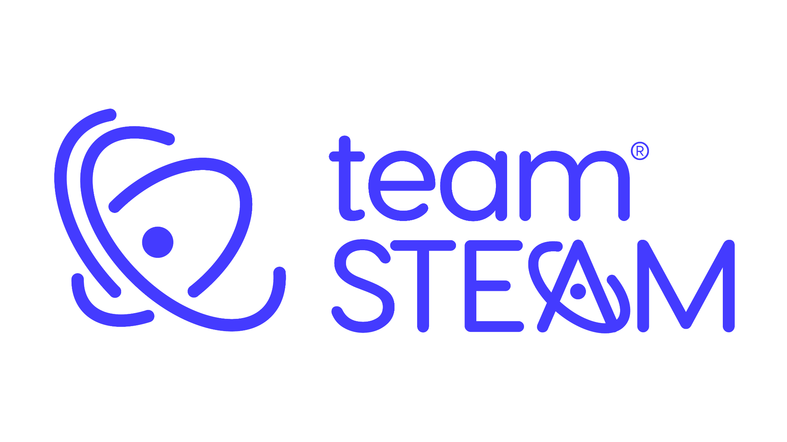
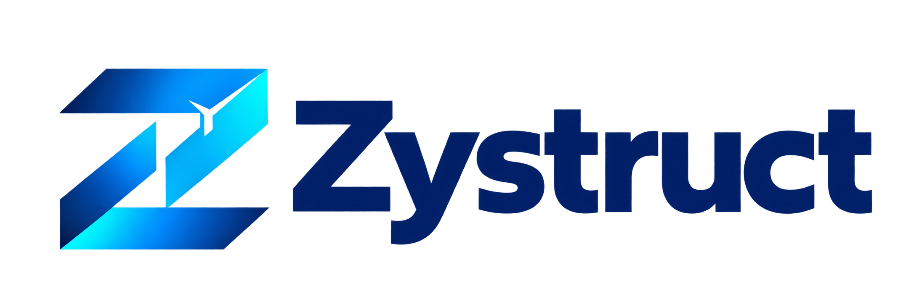

**Desarrolladora de software | Informática Empresarial, UCR | Costa Rica**

---

## Sobre mí

Soy desarrolladora de software y estudiante en la etapa final del Bachillerato en Informática Empresarial de la Universidad de Costa Rica. Me interesa crear aplicaciones web y móviles que resuelvan necesidades reales, desde la experiencia de usuario hasta la lógica de negocio y los datos.

Actualmente realizo mi **práctica empresarial en Team STEAM Group** y continúo desarrollando **Zybus**, un producto de nuestra organización [Zystruct](https://github.com/Zystruct).

Trabajo con equipos colaborativos y me gusta comprender el problema, organizar una solución clara y cuidar la calidad de lo que construimos.

**Ubicación:** Costa Rica  
**Enfoque:** desarrollo full stack, aplicaciones web y móviles, integración de APIs

---

<h2>Dónde construyo y colaboro?</h2>

<table>
  <tr>
    <td align="center" width="50%">
      
        
      <strong>Práctica empresarial</strong>
       
      Migración y desarrollo de la plataforma web
    </td>
    <td align="center" width="50%">
      
        
      <strong>Organización y producto propio</strong>
       
      Desarrollo continuo de Zybus
    </td>
  </tr>
</table>

## Tecnologías y herramientas

| Área | Tecnologías |
| --- | --- |
| Frontend y móvil | React, React Native, Vue.js, Angular, HTML, CSS, Tailwind CSS |
| Backend y APIs | .NET, C#, FastAPI, Python, Spring Boot, Java, Laravel, PHP, Node.js |
| Bases de datos | PostgreSQL, MySQL, SQL Server |
| Herramientas | Git, GitHub, Docker, Postman, Expo, Visual Studio Code |
| Forma de trabajo | Scrum, desarrollo colaborativo e integración de APIs REST |

---

## Otro proyecto destacado

### SuperLaCentral | Sistema administrativo

Participé en el desarrollo full stack de un sistema administrativo para un supermercado. Trabajé con Angular y .NET en funcionalidades de gestión, validaciones, operaciones CRUD e integración entre frontend, backend y base de datos.

**Tecnologías:** Angular, .NET, C# y SQL Server.

## Formación

**Universidad de Costa Rica**  
Bachillerato en Informática Empresarial | 2022–2027

Mi formación incluye programación, bases de datos, análisis de sistemas, ingeniería de software y gestión de proyectos. Actualmente aplico estos conocimientos en mi práctica empresarial y en el desarrollo continuo de Zybus.

---

  

Si querés conocer mi trabajo o conversar sobre un proyecto, podés contactarme aquí:

  

  

Grimaldi Solano · Desarrollo de software · Costa Rica

